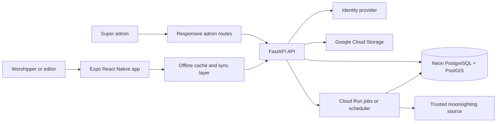
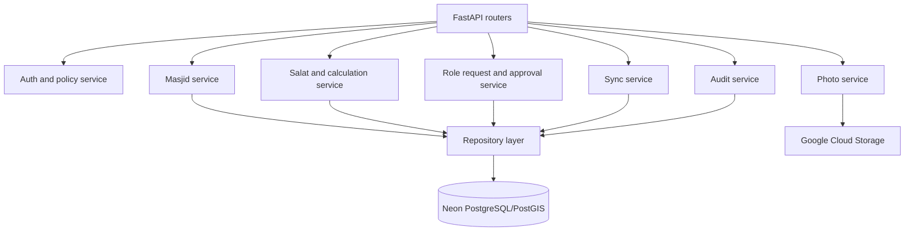
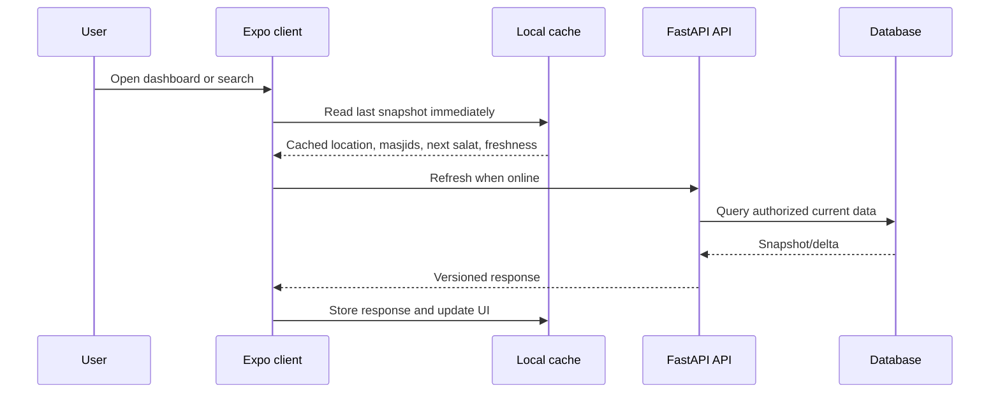
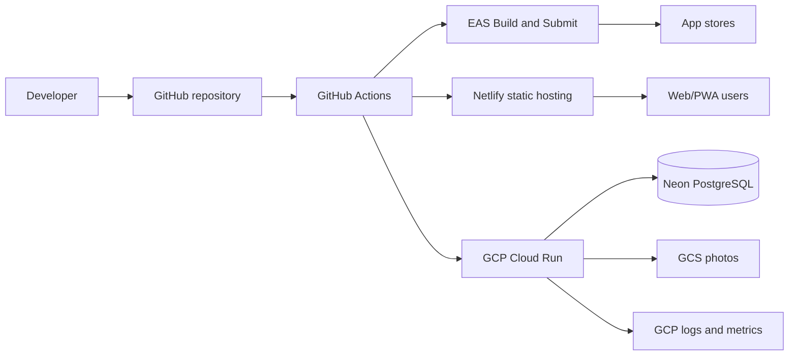

# Architecture

## Purpose and Status

This document defines the **proposed target architecture** for Jumapp. It is intended for the product and engineering team. The
current repository already contains the Expo shell, offline web assets, and a
minimal FastAPI service; feature services and persistence described below are
planned unless marked current.

The design must support worshippers/travelers, masjid/salat editors,
and super admins on iOS, Android, and Web/PWA. A user must be able to find a
masjid and its next salat time in under 30 seconds, including when the last
known data is cached.

## Architectural Principles

- **Offline-first:** Reads use the local snapshot first. Writes are queued and
       retried only when authenticated connectivity is available.
- **Server-authoritative data:** The backend owns masjid records, approved
       timings, roles, requests, and audit history. The client owns presentation and
       a temporary write queue.
- **Least privilege:** Public users can discover masjids and see only the next
       salat. Authenticated users can see editable timings only when their role and
       masjid scope permit it.
- **Traceable changes:** Every approved timing or masjid change records actor,
       timestamp, before/after values, and reason.
- **One domain contract:** iOS, Android, Web, the admin UI, and future jobs use
       versioned JSON APIs rather than direct database access.

## System Components

| Component | Responsibility | Status / boundary |
|---|---|---|
| Expo client | Routing, map/list discovery, detail screens, settings, notifications, i18n/RTL, cache status, and offline reads | Current foundation in `frontend/`; feature modules proposed |
| Admin routes | Mobile-friendly role approvals, masjid moderation, timing review, and audit log views | Proposed; may share the Expo app or be a separate web route group |
| FastAPI API | Authentication verification, authorization, validation, search, CRUD, approval workflows, and sync endpoints | Current app entry point exists; routers and services proposed |
| PostgreSQL/PostGIS | Durable relational data, geospatial vicinity queries, role scope, history, and audit records | Proposed Neon deployment |
| Identity provider | Google sign-in and username/password, refresh tokens, idle-session policy, and re-authentication | Proposed; Firebase Auth or another OIDC provider is unresolved |
| Google Cloud Storage | Masjid photos, signed upload/download URLs, type/size validation, and retention | Proposed; maximum five photos per masjid is configurable |
| Background jobs | Moonsighting import, notification preparation, cleanup, and retryable integration work | Proposed on GCP |
| Netlify | Hosts the static Expo web export and PWA assets | Current CI/CD target |
| EAS | Builds and optionally submits Android/iOS binaries; manages signing credentials | Current project configuration |

## Backend Architecture

Use a modular monolith in FastAPI first. It keeps transactions and authorization
centralized while leaving clear boundaries for later extraction.

### Domain modules

| Module | Key behavior |
|---|---|
| `auth` | Validate bearer tokens, expose user identity, enforce session and re-auth requirements. Never trust a client-supplied role. |
| `masjids` | Public vicinity search within a default 2 km radius, map/list filters, details, amenities, transport information, editor-scoped updates, and photo metadata. |
| `salat` | Calculate begin times from location/date using a proven `adhan`-compatible implementation, apply Hanafi defaults for Dehradun, store editable iqama/Khutbah values, and validate ordering and ranges. |
| `roles` | Accept requests containing name, phone, email, designation, and masjid relationship; prioritize imam/muazzin evidence; allow only authorized admins to approve or reject. |
| `sync` | Return a versioned snapshot/delta, accept idempotent queued mutations, and return per-operation conflicts or validation errors. |
| `audit` | Append immutable records for role, masjid, photo, and salat changes. Expose filtered records to super admins. |
| `integrations` | Import moonsighting dates from the approved trusted source with provenance, freshness, retries, and a last-known fallback. |

### Data model

The initial schema should include these aggregates and constraints:

| Entity | Important fields and constraints |
|---|---|
| `users` | External identity, display name, phone/email, locale, status; external identity is unique. |
| `masjids` | Name, `location` geography point, address, amenities, transport, editor metadata, and timestamps. Add a spatial index. |
| `salat_schedules` | Masjid, local date, calculation settings, calculated begin times, editable iqama/Khutbah times, source, and version. |
| `role_assignments` | User, role (`user`, `salat_editor`, `masjid_editor`, `super_admin`), masjid scope, status, and approver. |
| `role_requests` | Applicant identity snapshot, designation, masjid, evidence/status, decision, and timestamps. |
| `photos` | Masjid, object key, MIME type, size, checksum, moderation status, and sort order. Enforce configurable `MAX_PHOTOS_PER_MASJID` (default 5). |
| `audit_events` | Actor, action, entity, entity ID, before/after JSON, reason, request ID, and created time. Append-only access for application code. |
| `source_snapshots` | Moonsighting source, retrieved date, effective date, payload hash, status, and error details. |

## Client Architecture and User Flows

The `frontend/` app uses Expo Router and shared React Native components. Keep
domain data access out of screens: screens call typed feature services, which
call a single API client and cache adapter.

Required client behavior:

- Without sign-in, show map/list discovery and only the next salat time.
- Require sign-in for editable salat details and all mutations.
- Resolve location in order: current permission, saved location, last known
       location. Show a clear permission-denied and no-results state.
- Show last-updated time, online/offline state, stale-data state, loading
       skeletons, empty results, retry action, and save-success/error feedback.
- Keep touch targets at least 44 px, support keyboard and screen readers, and
       support English, Hindi, and Urdu with RTL layout. Respect reduced-motion
       settings; use haptics only on supported native platforms.
- Highlight the next salat. On Friday, show and emphasize Khutbah and Juma
       iqama. Keep the next-iqama countdown prominent without obscuring content.
- Configure notifications per salat. Native scheduling must use Expo-supported
       notification APIs; Web behavior must be documented separately because
       browser notification support varies.
- Use platform guards for native APIs and never import `window` or `document`
       on native platforms.

### Offline and synchronization

| Platform | Read cache | Write behavior | Recovery |
|---|---|---|---|
| iOS/Android | AsyncStorage snapshot and metadata | Queue authenticated mutations locally; attach an idempotency key | Retry on connectivity change; show conflicts and preserve unsent data |
| Web/PWA | CacheStorage/service worker for shell/API plus app state storage | Queue only supported authenticated mutations; do not cache tokens in service-worker data | Network-first API with cached fallback; show stale timestamp and retry |

The service worker remains cache-first for static assets and network-first for
API data. Cached data must be scoped to the signed-in user where applicable;
sensitive API responses must not be placed in a shared public cache.

## API Contract

All API responses use JSON and a version prefix such as `/api/v1`. OpenAPI
generated by FastAPI is the contract source for client types and integration
tests.

| Endpoint group | Examples | Authorization |
|---|---|---|
| Discovery | `GET /api/v1/masjids?lat=&lon=&radius=2000`, `GET /api/v1/masjids/{id}` | Public; detail response redacts editable fields as required |
| Schedules | `GET /api/v1/masjids/{id}/schedule`, `PATCH .../schedule` | Read next salat public; full/editable data requires auth and role |
| Sync | `GET /api/v1/sync?cursor=`, `POST /api/v1/sync/mutations` | Authenticated; idempotency and conflict response required |
| Roles | `POST /api/v1/role-requests`, `GET/PATCH /api/v1/admin/role-requests/{id}` | Requester / super admin |
| Photos | `POST /api/v1/masjids/{id}/photos`, `DELETE .../{photoId}` | Masjid editor or super admin; signed GCS URLs |
| Audit | `GET /api/v1/admin/audit-events` | Super admin, with pagination and filters |
| Operations | `GET /health`, `GET /ready` | Health endpoint public; readiness checks dependencies |

Validation must reject impossible times, invalid coordinates, unsupported photo
types/sizes, duplicate requests where applicable, and unauthorized scope. Use
standard open-source rate limiting at the API boundary, especially for auth,
search, uploads, and role requests.

## Design Patterns

- **Modular monolith:** Domain modules share one deployable FastAPI service and
       database transaction boundary.
- **Repository/service layers:** Routers translate HTTP; services enforce
       domain rules; repositories perform persistence. This makes rules unit-testable.
- **Policy-based authorization:** Central policies evaluate role, masjid scope,
       ownership, and re-authentication rather than scattered role checks.
- **CQRS-lite:** Separate read models for fast public discovery and mutation
       commands for approved changes; do not introduce a separate event bus initially.
- **Outbox/audit pattern:** Write the business change and audit event in one
       transaction. Use an outbox later if external notifications require delivery
       guarantees.
- **Stale-while-revalidate:** Render cached data immediately, then refresh and
       expose freshness to the user.
- **Idempotent command processing:** Client retries use an idempotency key so an
       offline retry cannot duplicate a role request or update.
- **Adapter pattern:** Hide the identity provider, map provider, moonsighting
       source, and storage provider behind interfaces so providers can change.

## Cloud and Delivery Architecture

| Platform | Role |
|---|---|
| GCP | Run the containerized FastAPI API on Cloud Run; use Cloud Scheduler/Jobs for imports and retries, Cloud Storage for photos, Secret Manager for runtime secrets, and Cloud Logging/Monitoring for operations. |
| Neon | Managed PostgreSQL with PostGIS for durable relational and geospatial data. Configure backups, migrations, connection limits, and separate environments. |
| EAS | Build signed Expo Android/iOS artifacts from `frontend/`, increment versions, and optionally submit to Google Play/App Store. Credentials remain in EAS or the CI secret store. |
| Netlify | Serve `expo export --platform web` output from `frontend/dist`, apply `_redirects` and `_headers`, and publish the PWA service worker/manifest. |
| GitHub Actions | Run quality gates and coordinate independent backend, PWA, and EAS release jobs. |

The public client must receive API base URLs and non-secret configuration through
environment-specific build configuration. Database credentials, signing keys,
identity secrets, and GCP/Netlify tokens must never be bundled into the client.

## Development Lifecycle

1. **Plan:** Update the relevant requirement and API/architecture decision;
        resolve open questions before implementing cross-cutting behavior.
2. **Implement:** Work in a short-lived branch. Add migrations, API contract
        changes, client states, and focused tests together.
3. **Validate locally:** Run from the repository root: `npm run lint`,
        `npm run typecheck`, `npm run test`, and `npm run build:web`. Run backend
        tests and a local `uvicorn` health check when backend code changes.
4. **Review:** Open a pull request. CI must pass lint, unit tests, web build,
        typecheck, API tests, and migration checks. Reviewers verify authorization,
        offline behavior, accessibility, and audit coverage.
5. **Stage:** Deploy the API to a non-production Cloud Run service and the PWA
        to a preview/staging Netlify site. Run smoke tests for discovery, auth,
        role approval, timing edits, offline fallback, and photo limits.
6. **Release:** Tag `vX.Y.Z` on `master`. GitHub Actions runs Android, iOS, and
        PWA delivery in parallel; store submission remains an explicit approval.
7. **Operate:** Monitor health, latency, error rate, job failures, stale data,
        and audit write failures. Roll back the client or Cloud Run revision when a
        release fails; database migrations must be backward-compatible first.

## Security, Reliability, and Observability

- Enforce HTTPS, strict production CORS, token expiry/refresh, idle timeout,
       and re-authentication for role approval, photo deletion, and timing changes.
- Validate uploaded content server-side and issue short-lived signed URLs. Do
       not expose GCS bucket credentials or unrestricted object listing.
- Apply pagination and bounded radius/filter parameters to discovery endpoints.
- Use structured logs with request/correlation IDs. Do not log access tokens,
       passwords, or unnecessary personal data.
- Record metrics for API failures, sync conflicts, queue age, cache age, import
       freshness, notification scheduling failures, and photo rejection counts.
- Treat the last successful schedule and moonsighting import as a fallback,
       visibly labelled with its freshness; never silently present stale data as
       current.

## Open Questions and Decisions

- Select and document the authoritative moonsighting source and its licensing,
       timezone, update schedule, and failure fallback.
- Choose the identity provider and confirm Google sign-in, password login,
       refresh-token rotation, account deletion, and re-authentication behavior.
- Confirm whether an admin portal is a route group in the Expo app or a separate
       frontend, while preserving the same API and policy layer.
- Select the map provider and confirm native iOS/Android support, Web support,
       offline tiles, licensing, and API-key restrictions. Leaflet alone is not a
       native map solution.
- Confirm the notification product requirements for Web, iOS, and Android,
       including timezone changes and permission denial.
- Decide the exact calculation library/version, timezone library, rounding
       rules, and whether calculated begin times are regenerated or snapshotted.
- Define moderation, retention, and deletion rules for masjid photos and
       personal data, including audit-log retention.
- Confirm production domains, Cloud Run region, Neon regions/environments,
       backup objectives, rate-limit values, and cost limits.

## Current Repository Anchors

- `frontend/` uses Expo SDK 54, Expo Router, typed routes, and static web
       output. Its `package.json` already includes AsyncStorage and NetInfo.
- `frontend/public/service-worker.js` implements app-shell/static-asset
       caching and network-first data fallback; it needs user-scope and API-cache
       review before sensitive data is enabled.
- `backend/app/main.py` currently provides FastAPI root and `/health` endpoints
       with configurable CORS. Domain routers, persistence, authentication, and
       readiness checks are future work.
- `docs/CICD.md` defines the existing GitHub Actions model for EAS and Netlify;
       backend Cloud Run deployment must be added to that lifecycle.