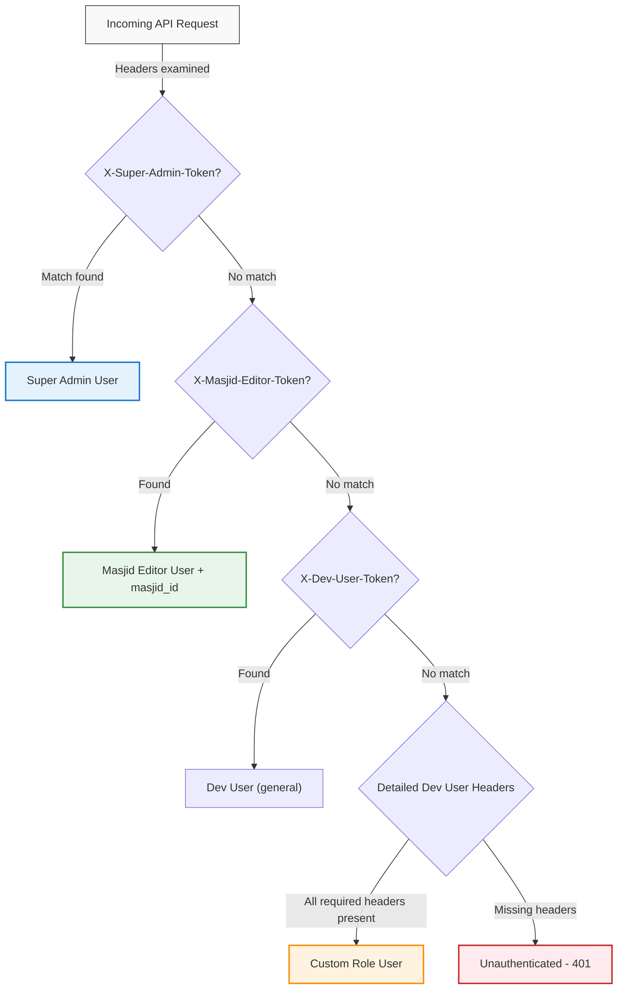
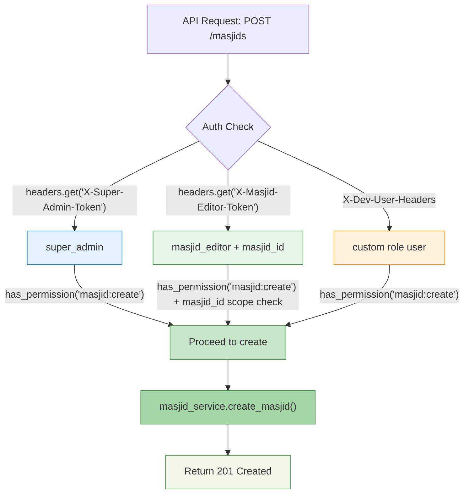
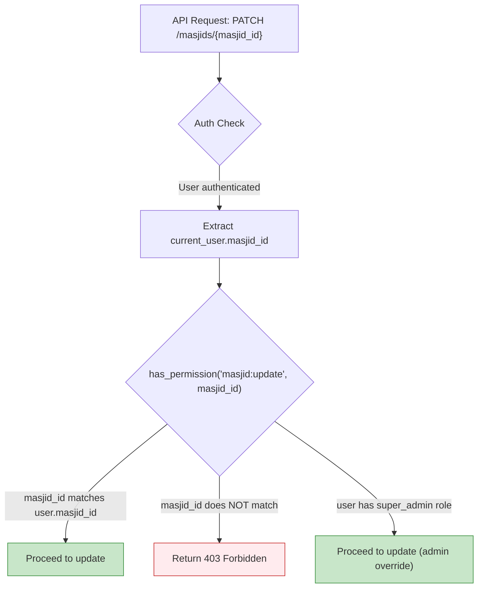
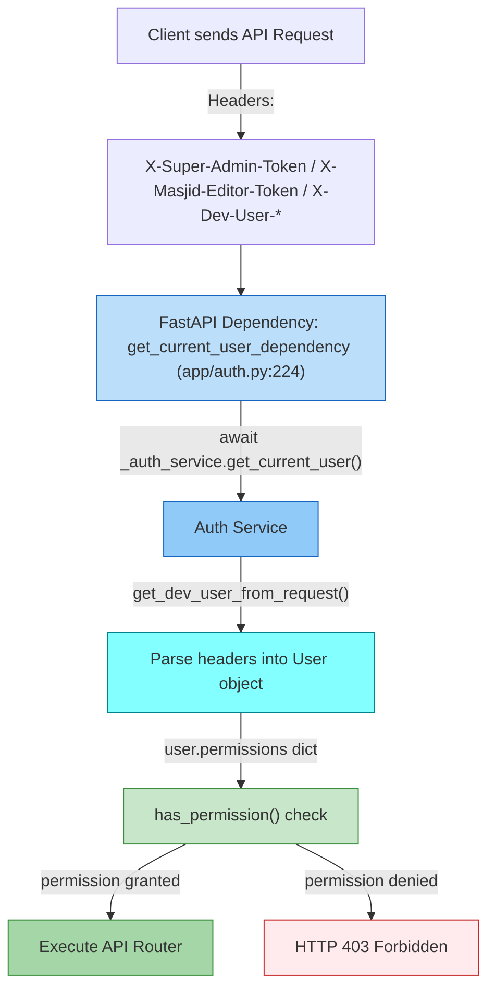

# Authentication and Access Control Diagram

## 1. Authentication Methods Diagram

The project supports **three authentication methods** in development mode, checked in priority order within `app/auth.py`:



### Authentication Method Details

| Method | Header | Priority | Role Assigned | Key Properties |
|--------|--------|----------|---------------|----------------|
| **Super Admin Token** | `X-Super-Admin-Token` | 1st | `super_admin` | Must equal `dev-super-admin-token`; full admin access |
| **Masjid Editor Token** | `X-Masjid-Editor-Token` | 2nd | `masjid_editor` | Contains `masjid_id`; scoped to assigned masjid |
| **Dev User Headers** | `X-Dev-User-*` | 3rd | Depends on `X-Dev-User-Role` | Flexible; supports any role configuration |

**Header precedence order** (from `auth.py:get_dev_user_from_request`, line 66-115):
1. `X-Super-Admin-Token` → `super_admin` role
2. `X-Masjid-Editor-Token` → `masjid_editor` role with `masjid_id`
3. `X-Dev-User-Id`, `X-Dev-User-Email`, `X-Dev-User-Role`, `X-Dev-User-Access-Level`, `X-Dev-User-Name`, `X-Dev-User-Masjid-Id` → custom role

---

## 2. Role-Based Access Control Matrix

The following table defines permissions per role. Permissions are defined in `app/auth.py:_get_permissions_for_role` (line 117-163).

| Permission | super_admin | masjid_editor | salat_editor | default/viewer |
|------------|-------------|---------------|--------------|----------------|
| `masjid:read` | ✅ True | ✅ True | ❌ False | ❌ False |
| `masjid:create` | ✅ True | ✅ True | ❌ False | ❌ False |
| `masjid:update` | ✅ True | ✅ True | ❌ False | ❌ False |
| `masjid:delete` | ✅ True | ✅ True | ❌ False | ❌ False |
| `salat:read` | ✅ True | ✅ True | ✅ True | ✅ True |
| `salat:create` | ✅ True | ✅ True | ✅ True | ❌ False |
| `salat:update` | ✅ True | ✅ True | ✅ True | ❌ False |
| `salat:delete` | ✅ True | ✅ True | ❌ False | ❌ False |
| `program:read` | ✅ True | ✅ True | ✅ True | ✅ True |
| `program:create` | ✅ True | ✅ True | ❌ False | ❌ False |
| `program:update` | ✅ True | ✅ True | ❌ False | ❌ False |
| `program:delete` | ✅ True | ✅ True | ❌ False | ❌ False |
| `person:read` | ✅ True | ✅ True | ✅ True | ✅ True |
| `person:create` | ✅ True | ✅ True | ❌ False | ❌ False |
| `person:update` | ✅ True | ✅ True | ❌ False | ❌ False |
| `person:delete` | ✅ True | ✅ True | ❌ False | ❌ False |
| `photo:read` | ✅ True | ✅ True | ✅ True | ✅ True |
| `photo:create`, `delete` | ✅ True | ✅ True | ❌ False | ❌ False |
| `admin:read` | ✅ True | ❌ False | ❌ False | ❌ False |
| `admin:approve` | ✅ True | ❌ False | ❌ False | ❌ False |
| `sync:write` | ✅ True | ❌ False | ❌ False | ❌ False |

**Notes:**
- `masjid:create`, `masjid:update`, `masjid:delete` are **True for both** `super_admin` and `masjid_editor` in the base permissions, but the `has_permission` method (line 48-52) adds a `masjid_id` scope check for editor roles.
- `salat:delete` is only permitted for `masjid_editor` (not `salat_editor`).
- `admin:approve` and `sync:write` are super_admin-only.

---

## 3. Masjid Creation/Editing Access Flow

### Creation Flow



**Creation permissions:**
- `super_admin`: Can create masjids **anywhere** (no masjid_id scope required)
- `masjid_editor`: Can create masjids **only if** `has_permission("masjid:create")` passes; additionally, the editor's `masjid_id` may be assigned to the newly created masjid

### Editing Flow (UPDATE)



**Editing permission checks** (from `routers/__init__.py:update_masjid`, line 325):
```python
if not current_user.has_permission("masjid:update", str(masjid_id)):
    raise HTTPException(
        status_code=status.HTTP_403_FORBIDDEN,
        detail="You don't have permission to update this masjid"
    )
```

**Key rule:** The `has_permission` method (auth.py:50) checks:
```python
if masjid_id and self.masjid_id != masjid_id:
    return False
```
- `masjid_editor`: Can only edit masjids where `masjid_id` matches their assigned masjid
- `super_admin`: Bypasses the masjid_id check (their `masjid_id` is typically `None` or they bypass entirely)

### Deletion Flow

Same as editing - `has_permission("masjid:delete", str(masjid_id))` with masjid_id scope check.

---

## 4. API Request Pattern

### Request Flow Diagram



### Dependency Injection Flow

1. **`get_current_user_dependency`** (auth.py:224-229):
   - FastAPI dependency injected into every router endpoint
   - Receives `request: Request` and optional `credentials: HTTPAuthorizationCredentials`
   - Delegates to `_auth_service.get_current_user(request, credentials)`

2. **`_auth_service.get_current_user()`** (auth.py:165-194):
   - If `settings.auth_mode == "dev"`: calls `get_dev_user_from_request(request)`
   - If credentials present: also checks dev user headers
   - Returns `User` object or raises `401 Unauthorized`

3. **`User.has_permission()`** (auth.py:48-52):
   ```python
   def has_permission(self, permission: str, masjid_id: Optional[str] = None) -> bool:
       if masjid_id and self.masjid_id != masjid_id:
           return False
       return self.permissions.get(permission, False)
   ```
   - First checks masjid_id scope match (if `masjid_id` parameter provided)
   - Then checks `self.permissions` dict for the given permission key

### Headers Involved

| Header | Purpose | Typical Value |
|--------|---------|---------------|
| `X-Super-Admin-Token` | Super admin authentication | `dev-super-admin-token` |
| `X-Masjid-Editor-Token` | Masjid editor authentication | Masjid UUID string (e.g., `"masjid-uuid-1234"`) |
| `X-Dev-User-Token` | General dev token fallback | Any string |
| `X-Dev-User-Id` | User ID for dev user | UUID string |
| `X-Dev-User-Email` | User email | Email string |
| `X-Dev-User-Role` | User role | `super_admin`, `masjid_editor`, `salat_editor` |
| `X-Dev-User-Access-Level` | Access level | `admin`, `editor`, `viewer` |
| `X-Dev-User-Name` | User name | Free text |
| `X-Dev-User-Masjid-Id` | Assigned masjid ID | UUID string |
| `Authorization` | Bearer token (HTTPBearer) | Currently `auto_error=False`, headers take priority |

---

## 5. Example Scenarios

### Example 1: Super Admin Creating a Masjid

**Request:**
```
POST /masjids
Headers:
  X-Super-Admin-Token: dev-super-admin-token
  X-Request-ID: req-abc123
```

**Flow:**
1. Request reaches `create_masjid` router (routers/__init__.py:267)
2. `get_current_user_dependency` extracts user via `X-Super-Admin-Token` (auth.py:69-79)
3. User created with:
   - `role="super_admin"`
   - `permissions` includes `masjid:create: True`
   - `masjid_id: None` (super admins aren't tied to a specific masjid)
4. Permission check at line 277: `current_user.has_permission("masjid:create")` → **True** (no masjid_id parameter, so scope check skipped)
5. `masjid_service.create_masjid()` executes
6. **Response: 201 Created** - Masjid created successfully

**Result:** Super admin can create masjids without any masjid_id restrictions.

---

### Example 2: Masjid Editor Editing Their Assigned Masjid

**Request:**
```
PATCH /masjids/{masjid_id}
Headers:
  X-Masjid-Editor-Token: masjid-uuid-5678
  X-Request-ID: req-def456
```
*(Where `{masjid_id}` in the URL path = `masjid-uuid-5678`)*

**Flow:**
1. Request reaches `update_masjid` router (routers/__init__.py:314)
2. `get_current_user_dependency` extracts user via `X-Masjid-Editor-Token` (auth.py:82-93)
3. User created with:
   - `role="masjid_editor"`
   - `masjid_id="masjid-uuid-5678"` (assigned masjid from token)
   - `permissions` includes `masjid:update: True`
4. Permission check at line 325: `current_user.has_permission("masjid:update", str(masjid_id))`
   - Inside `has_permission()`: `self.masjid_id ("masjid-uuid-5678") == masjid_id ("masjid-uuid-5678")`, so the scope check does **not** trigger the early `return False`
   - `self.permissions.get("masjid:update", False)` → **True**
   - **Overall: True** (masjid_ids match)
5. Masjid update proceeds
6. **Response: 200 OK** - Masjid updated successfully

**Result:** Masjid editor can edit their assigned masjid because the `masjid_id` in the token matches the `masjid_id` in the URL path.

---

### Example 3: Regular User Trying to Edit (Denied)

**Request:**
```
PATCH /masjids/{masjid_id}
Headers:
  X-Dev-User-Token: some-dev-token
  X-Dev-User-Role: default
  X-Dev-User-Access-Level: viewer
  X-Dev-User-Masjid-Id: masjid-uuid-9999
  X-Request-ID: req-xyz789
```
*(Where `{masjid_id}` in the URL path = `masjid-uuid-5678` - a different masjid)*

**Flow:**
1. Request reaches `update_masjid` router
2. `get_current_user_dependency` extracts user via detailed dev headers (auth.py:96-113)
3. User created with:
   - `role="default"`
   - `masjid_id="masjid-uuid-9999"` (assigned to a different masjid)
   - `permissions`: only `masjid:read: True`, all write permissions `False`
4. Permission check at line 325: `current_user.has_permission("masjid:update", str(masjid_id))`
   - Inside `has_permission()`: `masjid_id = "masjid-uuid-5678"`, `self.masjid_id = "masjid-uuid-9999"` → `"masjid-uuid-9999" != "masjid-uuid-5678"` → **returns False** immediately
   - (The permissions dict is never even consulted here, since the scope check already failed)
   - **Overall: False**
5. HTTP Exception raised at line 326-329:
   ```python
   raise HTTPException(
       status_code=status.HTTP_403_FORBIDDEN,
       detail="You don't have permission to update this masjid"
   )
   ```
6. **Response: 403 Forbidden**

**Result:** Regular user is denied access because:
- Their assigned masjid (`masjid-uuid-9999`) doesn't match the target masjid (`masjid-uuid-5678`)
- They don't have the `masjid:update` permission in their permissions dict either

---